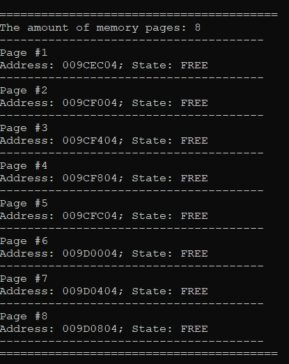
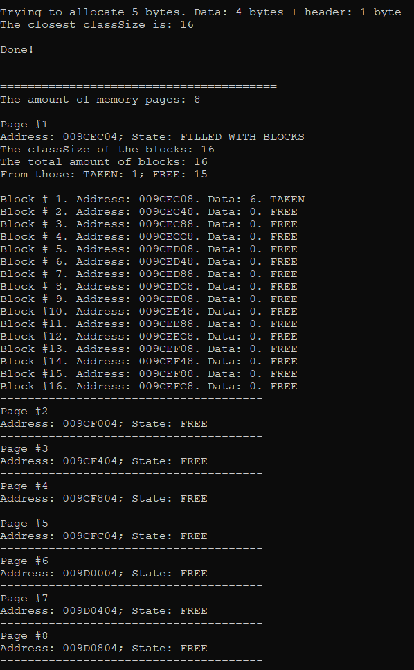
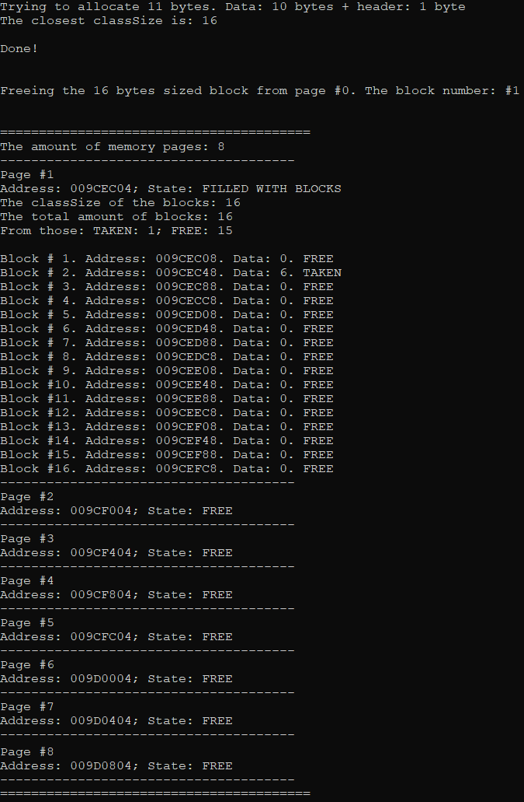
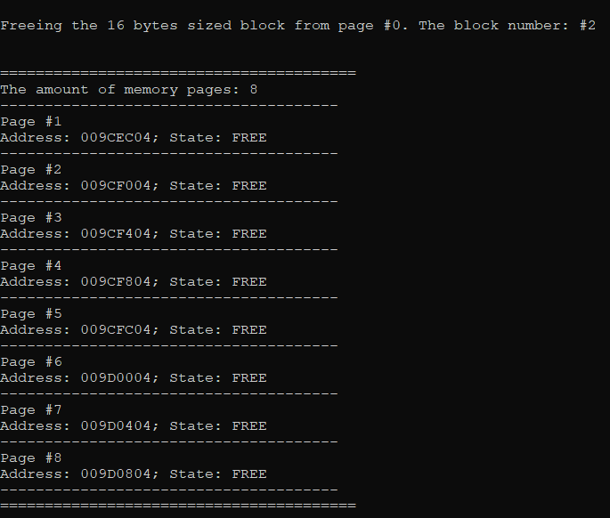

# Memory_Pages_Allocator_Simulator
## DESCRIPTION
### Brief description
A test of implementing the basic work mechanic of memory allocators (not actually implementing the allocator).
The algorithm suggests we have a continuous part of memory which is divided into "pages". The pages have a constant size of some of the powers of 2.

There are **3 basic types** of pages: **free** pages (actually free pages, without any division into blocks, can be taken to form any of the next two types), pages **divided into
blocks** that are lesser of equal to the half size of the page (these pages contain blocks, which are built from the header and the data chunks):    
> [ [ header: 1 byte ] [ data: n bytes ] ]    

The whole size of the block equals to any of the 2 powers (where the exponent is bigger or equal 4), and  lesser than half of the page size. The header contains the address of
the next free block in the page.

The 3rd type of the page is pages that are **taken by multipage blocks**. These types of block basically means that the block can be bigger than half of the page. The total size
of the block is then rounded to the closest suitable amount of the pages. So, the multipage block can start from one page's size and continue for some pages. These types of blocks
don't need headers because all information about the blocks will be written in a hash-table of pages describers:
> [ [ state: pageState ] [ classSize: int ] [ amount: int ] [ firstFreeBlock: void* ] ]      

The `state` variable contains the enum value of the three possible states of the page (`free`, `blockFilled`, `multipageBlockFilled`); the `classSize` variable contains the classSize of the block (if the page
is in **second** state) or the size of the whole block (if the page is in **third** state); the `amount` variable contains the amount of free blocks left in the page (if the page
is in **second** state) of the amount of the pages left ahead, including the current one (if the page is in **third** state); the `firstFreeBlock` variable contains the address
of the closest to the beginning to the page free block in this page (if the page is in **second** state) and `nullptr` (if the page is in **third** state).

### Algorithm description
#### `void* mem_alloc(size_t size)` function
When the `mem_alloc` function is called,
it searches for the smallest classsize of the blocks, satisfying the `size` criteria of the block (the size of that free block has to be at least `size + HEADER_SIZE`),
in the `freeClassBlocks` (the hashtable of [ `classSize` -> vector of page pointers with blocks of such `classSize`, containing at least one free block ]).
If it found such - it returns the block pointer, decreases the `amount` variable in the page Describer. Else, it searches for a free pages, takes the first found, fills it with blocks of the needed classSize (if the page is in **second** state) or searches for the needed amount of free pages, takes them and changes their Describers as needed.
If it didn't find any of those - it returns the `nullptr`.
#### `void* mem_realloc(void* addr, size_t size)` function
The `mem_realloc` function calls the `mem_alloc` function with the `size` parameter. If it returned the pointer to the valid memory part, it then copies the data that can fit
into the new block from `addr` and calls `mem_free` on the `addr`.
If `mem_alloc` return `nullptr`, `mem_realloc` returns the `nullptr` as well and doesn't change the `addr`.
#### `void mem_free(void* addr)` function
When the `mem_free` function is called,
it changes the Describers of the pages affected by the block (either multipage or inpage) that is allocated in that address and the `freeClassBlocks` hashtable if needed. Also, it sets `addr` to `nullptr`.
#### `void mem_dump` function
The `mem_dump` function prints the current state of each page in the memory part, with the blocks that are allocated in them, their addresses and data.
## HOW TO USE
To use the algorithm, open the file in any IDE with C++ support or use the [C++ shell website to compile the code](http://cpp.sh/).   
Describe your use cases in `main()` function or implement it in separate function, then calling it in `main()` function.
## DEMONSTRATION

> All memory state outputs are made with the `mem_dump` function.   

#### The creation of the 'default' sized 'heap' with 128 bytes of memory (8 bytes are immediately taken for the header)
##### Code
```  
MemoryAllocator allocator;     
   
allocator.mem_dump();    
```
##### Output

#### The allocation of the `int` sized block of memory with further initialization of it.
##### Code
```
void* a = allocator.mem_alloc(sizeof(int));
*(int*)a = 6;

allocator.mem_dump();    
```
##### Output

#### The reallocation of the previously created block of memory to size 10.
##### Code
```
a = allocator.mem_realloc(a, 10);

allocator.mem_dump();    
```
##### Output

#### The `mem_free` call for the previously created block of memory.
##### Code
```
allocator.mem_free(a);    
   
allocator.mem_dump();    
```
##### Output

